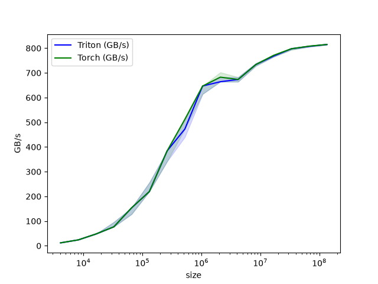
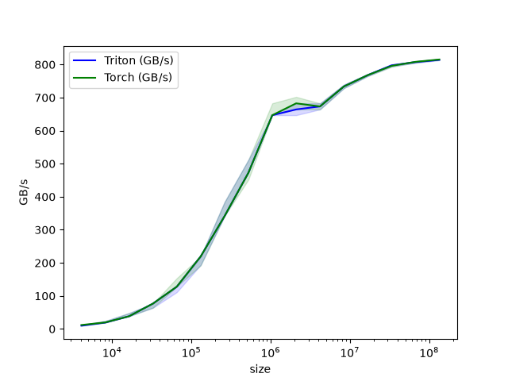
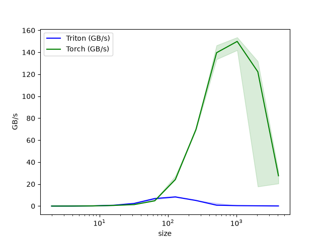
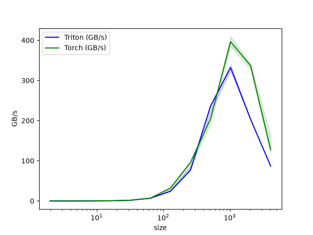
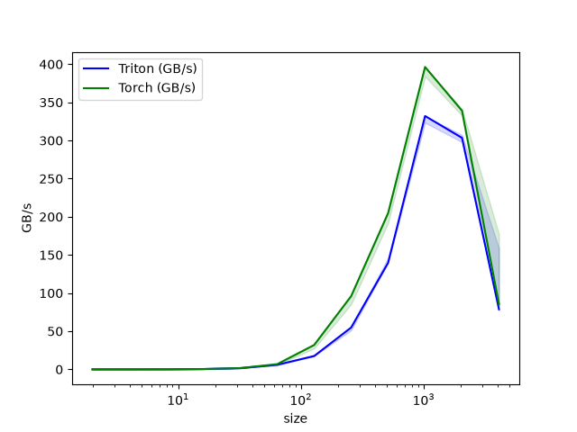
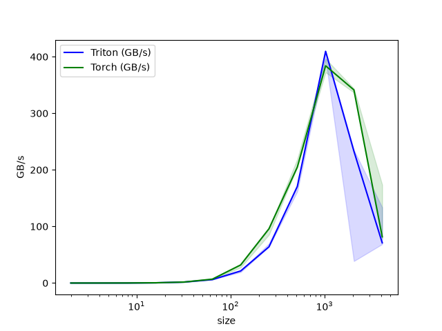
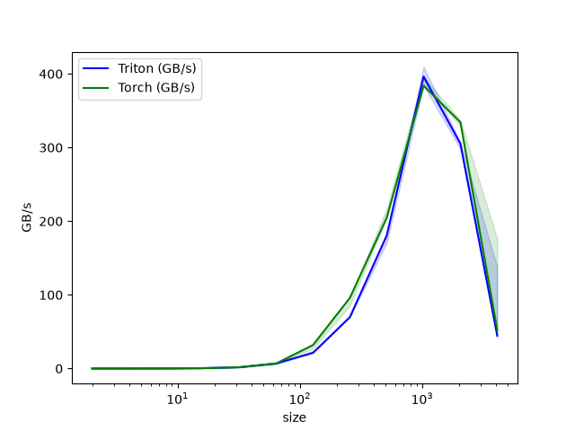
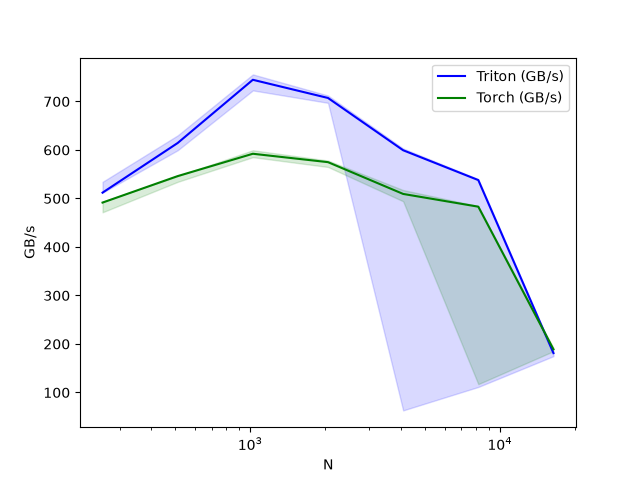

# triton-kernels

GPU kernels written in [Triton](https://github.com/triton-lang/triton), each with a
correctness test and a benchmark against its PyTorch baseline.

Benchmarks below were measured on a single **NVIDIA RTX 6000 Ada** (48 GB).

## Kernels

| # | Kernel | Op | Source | Test | Benchmark |
|:-:|--------|----|--------|------|-----------|
| 1 | `vector_add` | `x + y` | [vector_add.py](kernels/vector_add.py) | [test](tests/test_vector_add.py) | [bench](benchmarks/bench_vector_add.py) |
| 2 | `vector_subtract` | `x - y` | [vector_subtract.py](kernels/vector_subtract.py) | [test](tests/test_vector_subtract.py) | [bench](benchmarks/bench_vector_subtract.py) |
| 3 | `matmul_naive` | `A @ B` | [matmul_naive.py](kernels/matmul_naive.py) | [test](tests/test_matmul_naive.py) | [bench](benchmarks/bench_matmul_naive.py) |
| 4 | `matmul` | `A @ B` (tiled) | [matmul.py](kernels/matmul.py) | [test](tests/test_matmul.py) | [bench](benchmarks/bench_matmul.py) |
| 5 | `fused_vector_add_softmax` | `softmax(x + y)` (row-wise) | [fused_vector_add_softmax.py](kernels/fused_vector_add_softmax.py) | [test](tests/test_fused_vector_add_softmax.py) | [bench](benchmarks/bench_fused_vector_add_softmax.py) |

## 1. `vector_add` — element-wise `x + y`

Both Triton and PyTorch are memory-bandwidth-bound and plateau around ~815 GB/s —
as expected for an op that does one add per two loads and a store.



## 2. `vector_subtract` — element-wise `x - y`

Same bandwidth-bound profile as add; the Triton kernel matches the PyTorch baseline.



## 3. `matmul_naive` — matrix multiply `A @ B`

A straightforward first-pass matmul: one program instance per output element,
each looping over the shared inner dimension in `BLOCK_SIZE` chunks and
accumulating the dot product. It's correctness-first and not tiled/blocked for
data reuse, so it trails PyTorch's cuBLAS-backed `@` — the plot shows the gap a
naive implementation leaves on the table (and the baseline to optimize against).



## 4. `matmul` — tiled matrix multiply `A @ B`

A proper tiled implementation: each program computes a `BLOCK_SIZE_Y × BLOCK_SIZE_X`
output tile, looping over the inner dimension in `BLOCK_SIZE_K` chunks and
accumulating in registers with `tl.dot` (TF32 tensor cores). Because every loaded
tile is reused across the whole output block, it's compute-bound rather than
bandwidth-bound.

Block-size tuning trades performance across the size range — no single tile shape
is best everywhere. The config that tracks PyTorch's cuBLAS `@` best at the mid
sizes isn't the one that tracks best at the largest matrices:

| Block config A | Block config B (better at large sizes) |
|:---:|:---:|
|  |  |

A single hand-tuned config (64×128 tile, `BLOCK_SIZE_K=64`, `GROUP_SIZE_M=1`,
`num_stages=3`, `num_warps=8`) already tracks cuBLAS closely — the smaller tile
keeps enough program instances in flight to fill the SMs at mid sizes. The kernel
now goes further with `@triton.autotune`, which benchmarks a set of block-size /
`num_stages` / `num_warps` configs per problem shape and caches the fastest, so no
single config has to win everywhere:

| Single tuned config | Autotuned (per shape) |
|:---:|:---:|
|  |  |

## 5. `fused_vector_add_softmax` — row-wise `softmax(x + y)`

Fuses the element-wise add and a numerically stable (max-subtracting) softmax into
a single kernel: one program per row, using the online-softmax recurrence to get
the row max and the exp-sum in one streaming pass, then a second pass to normalize
and write. Because `x + y` is never materialized and the softmax avoids extra
global-memory round-trips, it beats PyTorch's unfused `softmax(x + y)` across most
of the feature-dimension range (rows fixed at 4096, columns `N` swept).



## Layout

```
kernels/              # kernel implementations (one module per kernel)
tests/                # pytest correctness tests (auto-skip without a GPU)
benchmarks/           # benchmarks vs. PyTorch; plots -> benchmark_outputs/
docs/                 # plots shown in this README
```

## Usage

Triton ships Linux + GPU wheels only, so kernels run on the GPU server rather than
locally. `sync.sh` handles the round trip (files sync to the login node over shared
NFS; commands run on the compute node via SSH `ProxyJump`):

```bash
./sync.sh push                                    # copy code to the server
./sync.sh gpus                                    # check which GPUs are free
./sync.sh run pytest -q                           # run the tests
./sync.sh run python benchmarks/bench_vector_add.py   # run a benchmark
./sync.sh pull                                    # bring plots/results back
```

Benchmarks auto-save a `.png` and `.csv` into `benchmark_outputs/`.

First-time server setup is one command (`./setup.sh`): it builds the
`triton-kernels` conda env from `environment.yml`, installs Triton, and runs the
tests. See [setup.sh](setup.sh) and [sync.sh](sync.sh) for details.
